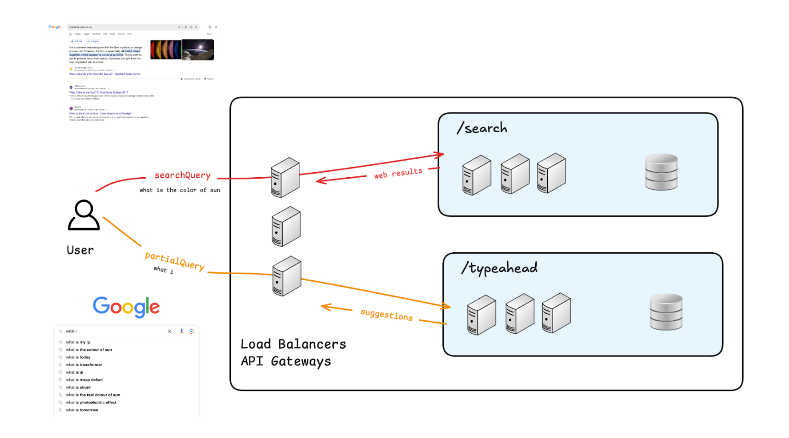
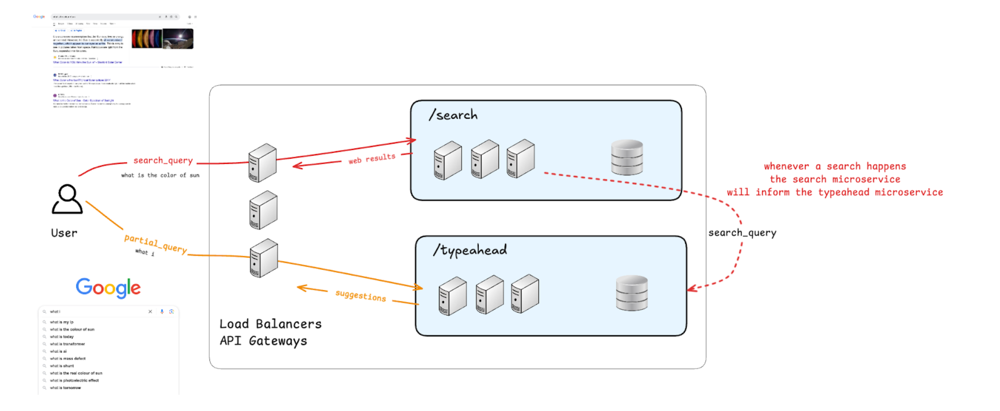
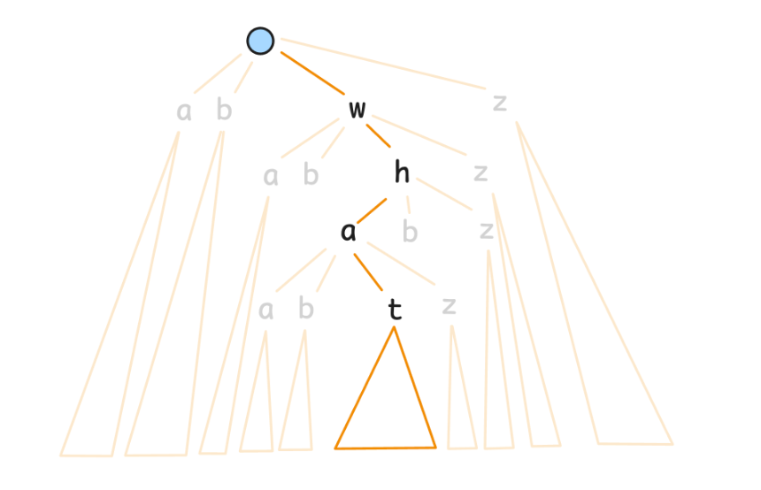
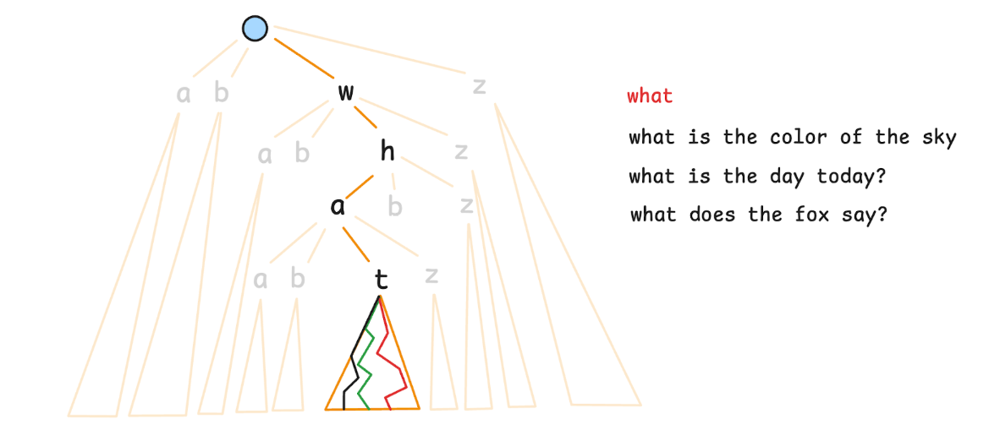
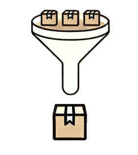

# Typeahead




## What not to build. 
Autocomplete is available in many different settings.  
1. **Smartphone Keyboards:**  word completion / contacts/.. 
2. **Text editors / Code editors:**   
a. intellisense: complete next token.  
b. Github CoPilot: can show entire functions
3. **Grammarly:**  sentence completion while prose writing
4. **Gmail / Outlook:** 
a. sentence completion for writing mail
b. to/cc/bcc: email completion from contacts


**Key difference b/w Typeahead & Autocomplete**  
Autocomplete is typically local to your machine. Any suggestions are specific to you. Autocomplete is standalone.   
Typeahead is always associated with search.  
The list of suggestions in typeahead are the most popular queries searched globally in the past, that match the given prefix.



Users are constantly searching on Google.  
Every time a user makes a search (search_query).  
• this search_query goes to the /search microservice   
• search microservice will return the relevant web-results   
• (async) the search microservice will inform the /typeahead microservice that this search has been made (pass the search_query)   
• the /typeahead service can store this search_query to populate its suggestions list

## Non-Functional Requirements(NFR)

Q: What is the data?  
Past search queries and their corresponding counts.

| Search Query   | Count | 
|----------|----------|
| why is the sky blue?    | 49,999     | 
| why is water wet?     | 50,000     | 
| what is the color of the ocean.     | 5,000     | 

**Q: What does eventual consistency mean in this context?**  
When is the data changing?  
Everytime someone makes a search.  
• the count of some entry changes.  
• the top-5 relevant results for some typeahead partial_query changes

It is possible for the search-count to reflect in a delayed manner in the top-5 results.   
For some time, it is possible that the true count of Query1 > Query2, but we still show Query2 above Query1 in the typeahead suggestions.

**Q: Can we afford stale reads in this situation?**
Yes, that's okay  
1. because the user doesn't really know (or care about) the true search counts 
2. we don't necessarily need to maintain a strict order in the typeahead suggestions  
    a. it is okay for a few good suggestions to not be shown, as long as the ones shown as also good enough


**Q: What does data loss mean in this context?**  
Data loss would happen if someone has searched for a query, but for whatever reason, we were not able to increment the count for that query (query didn't get logged).  
The counts will be off by a small amount.  

|Search Query   | True Count|
|-----------| --------|
|why is the sky blue?   |49,999|
|why is water wet?   |50,000
|what is the color of the ocean|  5,000|

|Search Query     |DB Count|
|------------| ----------|
|why is the sky blue?    |49,999|
|why is water wet?  |  49,998 (no issues)
|what is the color of the ocean   | 5,000|

**Q: Can we afford data loss in this situation?**  
Yes, that's okay. (same reasons as above)

Note: This does NOT mean that our counts will be off by huge margins.    
We're saying if the count for some query is off by <1 %, then nobody cares.    
We're saying if the count for some query is delayed by a few minutes, then nobody cares.  

### Consistency vs Latency. 
What are our latency requirements?  
Ultra-low latency - literally competing with the user's typing speed!  
each typeahead query to take < 10ms  
(this doesn't include the round trip - that depends on the user's distance from the servers - don't have much control over that - only solution for that is to have geolocated servers)

## Scale Estimation
The scale will dictate our design choices
### Goals
1. Amount of Data (in bytes)  
• Is sharding needed?
2. Amount of Load  
• Requests per second (for each API)
3. Peak Load (vs avg load)
4. Read-heavy / Write-heavy  
All these things will help us guide our choice of database, cache, & sharding

**Does accuracy matter?**  
No. Back-of-the-envelope estimates / approximations  
 being off by a factor of 2 or 3 is okay.  
Actual value: 100  
You suggest: 50 okay  
You suggest: 200 okay  
You suggest: 10 not okay (off by a factor of 10)  

However, any estimates that you make should be justified. Don't pull out numbers from thin air. You will have to make some assumptions - each assumption should be clearly stated as such.

## How to start

Start by estimating the number of Daily Active Users (DAU).

**Total number of users**  
World Population: ~8 billion  
Number of Internet Users: ~5 billion  
India's Population: ~1.4 billion  
USA's Population: ~350 million  

Pareto Principle (the 80/20 rule)  
Only 20% of your users will be active.  
Can be extended to the 80-20-1 principle for social media  
- 80% are just passively browsing
- 20% are interacting (comments, likes, shares)
- 1% are content creators (posts)

## Estimates

**assumption:** Google has 5 billion users.  
Daily Active Users (DAU): 20%  
= 20% of 5 billion users  
= 1 billion users

**assumption:** Number of searches per active-user per day: 20

**Total number of searches / day**  
= (20 searches / user/ day) * (1 billion users)  
= 20 searches / day * 1 billion  
= 20 billion searches / day  

Avg. searches / second  
= 20 billion searches / day  
= 20 * 109 searches / (105 seconds) (1 day = 86400 seconds   
= 200,000 searches / second)  

Note: searches are going to search API, not the typeahead API


**assumption:** Number of typeahead queries per search query:

**assumption:** avg size of a search query is 10 letters   
we will start showing suggestions after the first 3 letters   
avg. number of typeaheads per search would be (10 - 3) = 7 ~10

typeahead (...) **API: requests / second**  
Everytime a user is searching for something, they will first type the query, and then they will search.   
search_query: "why is the sky blue"
1. typeahead("why")
2. typeahead("why i") 
3. typeahead("why is") 
4. typeahead("why is t")
5. typeahead("why is th")
6. typeahead("why is the")
7. typeahead("why is the s")
8. ...
9. typeahead("why is the sky blue")


**log_search(...) API: requests / second**  
Every time a search is made, the /search microservice pings the /typeahead microservice  
= 200,000 requests / second

**Peak Load**
assumption: peak load is 5x the average load  
5 * (2 million typeaheads / second)   
= 10 million typeaheads / second

also, 1 million log_search / second

## Amount of Data
What's the data?  
Past search queries & their counts

|Search Query    |True Count|
|-------------|----------|
|why is the sky blue? |  49,999|
|why is water wet? |  50,000|
|what is the color of the ocean | 5,000|

Avg. size of search query: 10 letters (made this assumption earlier)   
How many entries in this table?

Should we say that for each search that happens, we will have an entry in this table?   

No. Because for new searches, we're adding entries.  

But for queries that have already been searched earlier, we're just updating the counts.  
The number of entries in the table will depend on the number of "unique" (never seen before in the history of Google) search queries that happen
   
assumption: % of search queries are new (never seen before) = 10%

number of new entries / day  
= 10% of (20 billion searches / day)  
=2 billion entries per day  

amount of data / day  
= (20 bytes / entry) * (2 billion entries / day)   
= 40 GB day  

total amount of data (over 20 years)  
= (40 GB day) * (20 years)  
= (40 GB / day) * (20 * 400 days) (365=~400)  
= 32 *10^4 GB  
= 320 TB  

**Can this amount of data fit on a single server?**  
Probably yes, with modern storage.  
But, will a single server be able to handle 10 million requests / second?  
Absolutely no!    

We need sharding!

### Read Heavy/ Write Heavy?
typeahead => read query (show suggestions) => 10 million requests second peak load  
log_search => write query (incr count) => 1 million requests / second peak load

reads are 10x more than writes

We will call this read heavy, because even though the system has to handle lots of writes too, it is dominated by reads.  

Whenever you've read heavy systems & the writes are also significant 
- you can absorb your reads in a cache
- optimize your DB for writes

No database system is optimized for both reads & writes (that's impossible)

## System Design  
Typical Components  
• Microservices  
• Load Balancer  
• Database choice  
  a.  SQL  
  b.  NoSQL  
        ■ justify  
• Cache choice  
  a. Need for caching  
  b. Type of cache  
    ■ Local vs Global  
    ■ (if global) Single vs Distributed  
  c. Invalidation  
  d. Eviction  
• Communication  
  a. user - backend  
  b. backend - backend  
• CDN  
• Observability  

Approach 1 – Tries  
If the user types the partial query "What", then we must show the top 5
search queries that are a strict prefix match.




Each trie node will store
1. children (all the subsequent letters)
2. isTerminal
3. count (only if is Terminal - the number of times this search query has been searched)

## Queries
typeahead (partialQuery)
1. go to the node that matches the partialQuery.  
a. start from root.  
b. for each letter of the partialQuery, we will go to the appropriate child
2. Once we've reached the matching node, all the possible suggestions are within the subtree of this node
3. We will have to go through the entire subtree (all possible suggestions that match the prefix), and find the top 5



Going through the entire subtree of a node will be highly time consuming.  
**There's potentially billions of entires in that subtree!**  
Can improve this by "data-augmentation"      
At every node, pre-compute & store the top5 results.  
In this case, the update will become slow

log_search(searchQuery)   
(update the count for this query)
1. traverse to the node that matches this searchQuery 
2. increment the count

## Sharding
**Q: What will be the sharding key?**
1. First letter: every query that starts with the letter a will go to the same shard. 
this doesn't mean that the starting letter a must get a dedicated shard - a single shard might contain multiple starting letters. We're just saying that all queries that start with the letter a must definitely go in the same shard.   
a. Low cardinality (only 26 possible children)   
b. Uneven data distribution
number of queries starting with a will be much higher
than the number of queries starting with z

2. First 3 letters: every query that starts with the letters abc will go
to the same shard this doesn't mean that the starting letters abc must get a dedicated shard - a single shard might contain multiple starting letters. We're just saying that all queries that start with the letters abc must definitely go in the same shard.   
a. High cardinality: 26^3 ~= 17000   
b. Uneven data distribution   
number of queries starting with why will be much higher
than the number of queries starting with zxz   
i. to fix the load distribution, we will have to manually create groups of starting 3 letters in order to club the less frequent queries together   
ii. number of queries starting with why will be much higher => dedicated shard   
iii. number of queries starting with zxz will be lower in count, so we will group them with other rare starting letters zyx + zxy + ...    

**Q: Which existing Databases support this?**   
There's no popular database that was built for storing tries!     
Tries exist as an 3rd party extension in some popular databases.     
However, no database was built specifically to store tries.   
So you must build your own DB.  

## Approach 2 - Hashmap / Key-Value

Search Frequency DB   
for each actual searchQuery it will store the count

|Search Query    | Count|
|------------|---------|
|what is the color of the sky | 5000|
|what is the day today | 1000|
|what is 2 + 2  |  10000|
|what does the fox say. |   2000|
|what does a fox eat?  |  1900|
|how to kill someone. |   2000|
|how to cook eggs.  | 1500|

## Queries
**typeahead (partial_query)**  
If someone types "what i" then we can just go to the suggestions
db, and look up that partialQuery.  

This will be very fast  
1. hashmaps have 0(1) lookup  
2. we don't need any computation / processing - we just have to get the value for the given key from the key-value DB  

We needed ultra low latency (< 10ms), and, high read throughput
(10 million reads / second at peak)  
• Redis lookup has latency of <= 1ms  
•  A single redis server can easily handle 100,000+ reads/writes per second!  
• just need ~100 servers  
(google has over 10 million servers - as of 2020)

**log_search(search_query)**  
Whenever someone searches for a query "what does the fox say"
1. I need to update the count in the search frequency database   
• super simple - just call redis.inc(searchQuery)
2. I need to update the cache (top suggestions database)   
• what all entries do I need to update?  
i.) If I'm updating the count for what does the fox say then is it possible for the suggestions of the prefix "how" to get changed?  
No.  
ii.) What prefixes will get effected?  
only the prefixes of the search query  
wha  
what  
what d  
what does the fox  
what does the fox s  
what does the fox sa  
what does the fox say  
iii.) **How many such prefixes (on average) need to be updated?**  
the average query is 10 letters. So ~10 prefixes on average need to be updated.  
but this now means, that for each update, I must do 1 + 10 writes  
total number of writes in redis  
= (1 million log_search / sec) * 11 writes log_search  
= 11 million writes / second  
this makes my system both read & write heavy!  
no db in the world that is optimized for both reads & writes  

## Sharding
Sharding is automatic - based on the hash (key)  
**Q: Are there databases that have 1st class support for hashmaps?**  
Yes. Not just 1 - there's an entire category!  

**Q: Which existing Databases support this?**  
Key-Value databases are basically just hashmaps that are distributed
across servers.
Redis/Memcached / DynamoDB / ...

## Optimizing the System.  
**If the system is read heavy**  
• If eventual consistency is okay, then ⇒ absorb the reads in the cache, and optimize the DB for writes.  
• If immediate consistency is needed, then optimize the DB for reads, because the writes are less. Both reads & writes now go
to the DB. This will be slower than the cached approach. 

**If the write load is high**  
• Irrespective of eventual vs immediate consistency ⇒ absorb the reads in the cache, and then optimize the DB for writes.  

**If the system is both read & write heavy**  
• very VERY difficult!  
• Either you can somehow "reduce" the writes  
    - Batching forces eventual consistency  
    - Sampling forces data loss  
• If you cannot reduce the writes, then you need to shard more  
    - but then, you can't join across shards efficiently

## Optimizing Writes
We can reduce the number of writes significantly, because, we can afford eventual consistency & data loss (non-functional requirements)

## Batching / Batch Processing



Instead of doing each task 1 by 1, you wait for a lot of tasks to pile up. And then you do all of them in 1 go as a batch. 

Whenever we get a log_search(search_query) request, instead of updating the suggestions db immediately, we wait for the count to
increase by a fixed amount (say 1000)

Earlier
```
fn log_search(search_query): // 1 million qps 
    frequency_db.inc(search_query) // 1 million qps
    update_prefixes (search_query)

fn update_prefixes(search_query):
    for i = 3... len(search_query) - 1
        prefix = search_query[:i]
        ... logic to update the suggestions list
        // 10 million qps 
            in the suggestions db
```

Batching
```
fn log_search(search_query):   // 1 million qps
    updated_count = frequency_db.inc(search_query)
    // 1 million qps
    if updated_count % 1000 == 0:
        // update the prefixes only if the count
        // has changed by the batch size
        update_prefixes (search_query)

fn update_prefixes (search_query):
    ... // (1 million / 1000 qps) * 10 updates
        // 10,000 writes/sec
```

Effectively, we will only update the suggestions when the count
increases by 1000.

**Earlier, we had**  
1 million writes/sec (freq db)  
+10 million writes/sec (suggestions db)

total = 11 million writes/sec

**After batching**  
1 million writes/sec (freq db)
+(10 million / 1000) writes/sec (suggestions db)

total = 1.01 million writes/sec

Note: we cannot make the number of writes less than 1 million per
second, because that's the number of times we've the update at least the counts in the frequency database.

Note: batching doesn't cause data loss (freq data is always up-to-date) - it just causes delays (stale reads) in the suggestions updates.

## Sampling

Exit polls during elections

1. country-wide election: 10 crore voters
2. the actual counting will take several days
3. News channels want to predict the winner with high accuracy
before the actual results are announced
4. The news channels will ask various people "who did you vote
for" and they will create their own voting list & winners
5. Can the news channels talk to all the 10 crore voters?
No.
6. They stand in front of a small fraction of the polling booths
As the people exit the booths, they will ask a few random
people "who did you vote for"
7. They will only use this small subset/sample of data to
"estimate" the winner
8. if the news channel is unbiased their exit poll results will almost perfectly match the actual election results

If you draw an unbiased sample from a population, then any trends that hold within the population will also hold within the sample. 

Typically a good way of getting unbiased samples is to just sample uniformly at random. 

Note: Sampling can cause data loss of individual data points. But
it won't lose the overall trends. (use it only when data loss is okay)

Earlier
search service
```
fn search(query):
    ...
    make an API call to typeahead service's log_search endpoint
```

typeahead service
```
    fn log_search(search_query):
        frequency_db.inc(search_query)
        update_prefixes (search_query)

    fn update_prefixes(search_query):
        for i = 3 ... len(search_query) - 1
            prefix = search_query[:i]
        ...logic to update the suggestions list in the suggestions db
```

Sampling
search service
```
fn search (query):
    ...
    if rand() < 0.001:
    // with a probability of 1/1000, make the following call
    make an API call to typeahead service's log_search endpoint 
```

typeahead service  
For 99.9% of the searches, we're not even updating the counts (just
ignore them)   
For a random 0.1% of the searches, we're calling the log_search
and we will update both the counts & the suggestions.   

Thanks to sampling, instead of having 1 million+ 10 million
writes/second, we now come back to just (1 million + 10 million) / 1000 = 10,000 writes / second  

**Q: Won't the counts be inaccurate?**  
Yes. Effectively, each count is being divided by 1000 (but not exactly -
it's random)  

**Q: Won't the suggestions be not exactly in order?**  
Yes.  
But none of that matters. Because still, the suggestions shown to the
users will continue to be highly relevant!  

**Q: If we use sampling, then won't infrequent queries have very low counts / might completely be missed out from the database?**  
Yes, that can happen! That's a feature, not a bug!
A rare query will never be a part of typeahead suggestions anyway
(because it is not popular)   
Effectively, sampling has automatically reduced your data massively by removing the majority (99.9%) of the bad queries

## Future Scope
### Recency Factor
Problem Statement 
Suppose there's a big event that happens  
• COVID lockdown gets declared  
• Election results are out  
• Some high profile person got arrested  
• Federer won the Wimbledon  
• ...  

This is a trending event.

Even though "who has control over nukes?" might have a higher overall count, but since the query "who won the Wimbledon?" is trending (recent + popular), we should rank that higher when someone types "who"

**Goal**
give more weightage to the recent counts

**Solution**
Simply decay the historical counts after every fixed period of time.
After each day, decrease the total count for each query by 10%
"who has control over nukes?"   
[1000, 1000, 1000, 1000, ...] => total is 100,000  
day 1: 1000  
day 2: 90% of 1000 + 1000 => 1900  
day 3: 90% of 1900 + 1000 => 2710  
day 4: 90% of 2710 + 1000 => 3439  
  
"who won the wimbledon"  
[0, 0, 0, .., 5000, 5000, 5000] => total is just 15000  
day 997: 0  
day 998: 5000  
day 999: 5000* 0.9 + 5000 => 9,500  
day 1000: 9500* 0.9 + 5000 => 13,550  

If the count after decay reduces below a threshold (say 0) then we can
remove that entry.  

## Geolocation based personalization  
Given the user's request, find out their location based on ip address.    
Build a separate database for each location ⇒ shard the DB by country_id  
Now an Indian user's request will only go to the Indian shard.  

"what does the fox say" => 1000  
"India:what does the fox say" => 10  
"USA: what does the fox say"=> 10  

When an Indian user types "wha❞  
Find the suggestions for, "wha" prefix, and the suggestions for  
"India:wha" prefix, we will merge the results, and then return the final  
set.

## User based personalization
Do this purely on the client side.  
The browser stores the user's search/browsing history.  
1. browser will create typeahead suggestions from the user's local
data  
2. browser will initiate a backend request to get the global
typeahead suggestions  
3. browser will merge these two lists  

## Handling Typos
You can simply have a dictionary and you can calculate the "edit-distance" b/w the user's words and the words in the dictionary.